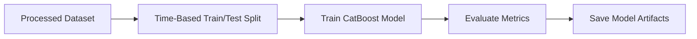

# Aero Delay Prediction

Passengers are often caught off guard by delays. This project uses years of
historical flight data to build an end-to-end delay prediction pipeline and pairs
it with a LangGraph conversational agent. The agent combines the delay model with
supporting tools to answer questions about upcoming flights, including whether a
flight is predicted to be delayed, so passengers can plan with fewer surprises.

Note: The current model is trained on U.S. flight delay data.

## Architecture Diagram

### Preprocessing


### Training



### Agent


**Tools Available** 
route confirmation, distance calculation, temporal feature, weather information, delay model inference.


Example Agent Flow:
- User asks: "Will my flight from Orlando to San Diego be delayed?"
- Agent asks for missing details (airline and time).
- User provides: "Delta, tomorrow afternoon."
- Agent calls tools to build features for inference.
- Agent calls the delay model inference tool to get a delay prediction.
- Agent generates a response.
- Evaluation checks relevance and bias; if it fails, the agent regenerates.

## Repository Structure (High Level)

- `ml_pipelines/` preprocessing, training, and full pipeline runners
- `data/` raw and cached datasets (local only)
- `models/` trained artifacts and evaluation outputs
- `agent/` interactive agent interface
- `src/` shared utilities and core code
- `notebooks/` exploration and experiments
- `project_report.md` detailed training results and analysis

## Setup

```bash
pip install -r requirements.txt
```

Create a `.env` file in the project root with required credentials:

```bash
# .env
BASE_PATH=/YOURSYSTEMPATH/Aero-delay-prediction
OPENAI_API_KEY=your_key_here
VISUAL_CROSSING_KEY=your_key_here
```

## Data

1. Download flight delay and cancellation dataset:
   ```python
   download_data_path = kagglehub.dataset_download("patrickzel/flight-delay-and-cancellation-dataset-2019-2023")
   ```
2. Download airport metadata (`airports.dat`) from [OpenFlights](https://openflights.org/data) and save as CSV.
3. Save raw data under `data/` (for example, `data/raw/`), then keep derived caches under `data/cache/`.
4. Confirm the input paths in `ml_pipelines/params/preprocessing/preprocessing_params.py` match the filenames you saved (for example, `data/raw/flights_sample_3m.csv` and `data/raw/airports.csv`).

## Run the Pipeline

From the project root:

```bash
python -m ml_pipelines.run_preprocessing
python -m ml_pipelines.run_training
```

To run the full pipeline end-to-end:

```bash
python -m ml_pipelines.full_training_pipeline
```

## Training Outputs

- Models and evaluation artifacts are written under `models/`.
- Use `project_report.md` for all training results, metrics, and analysis details.

## Run the Agent

From the project root:

```bash
python -m agent.customer_agent
```

## Run the Web App (Localhost)

From the project root:

```bash
python -m agent.web_app
```

Then open `http://127.0.0.1:8000` in your browser.

## Linting and Checks (Local)

Run the same checks as CI:

```bash
bash scripts/ci_check.sh
```

## Next Steps


- Add more robust prompts
- improve evaluations
- add unit tests
- improve prediction model
